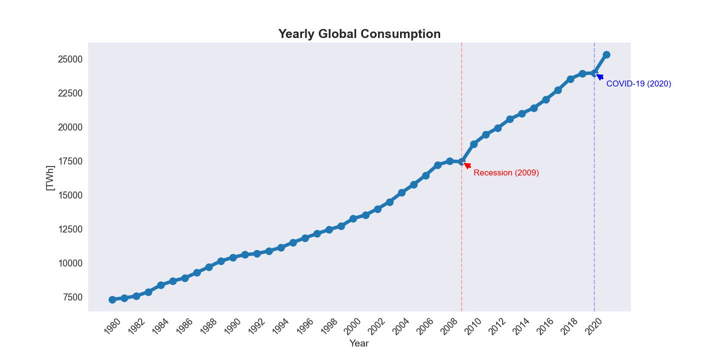
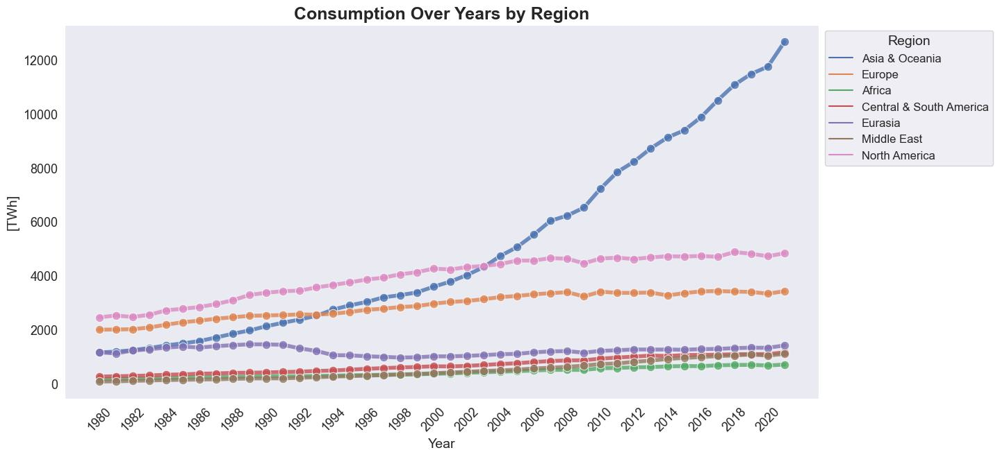
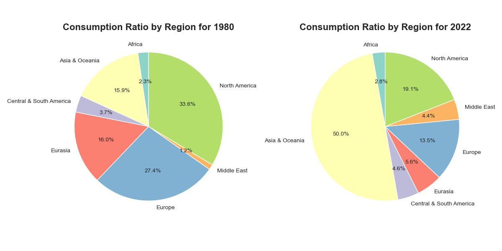
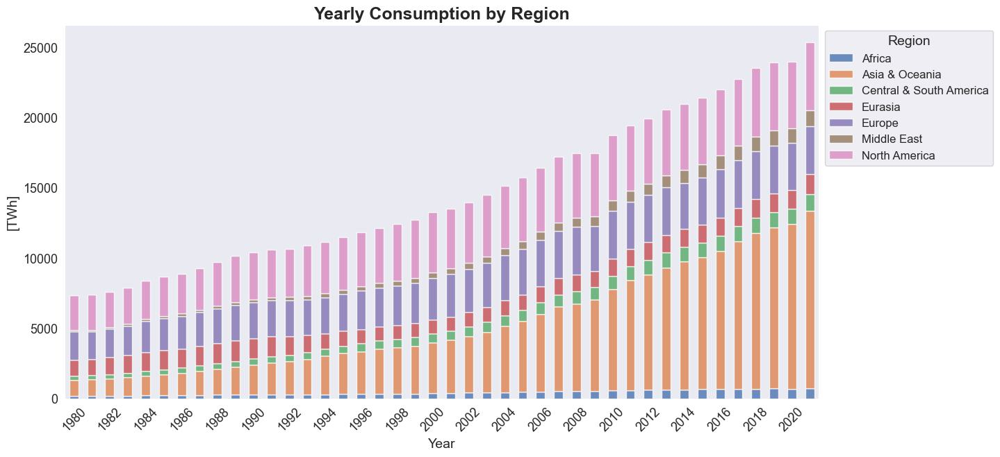
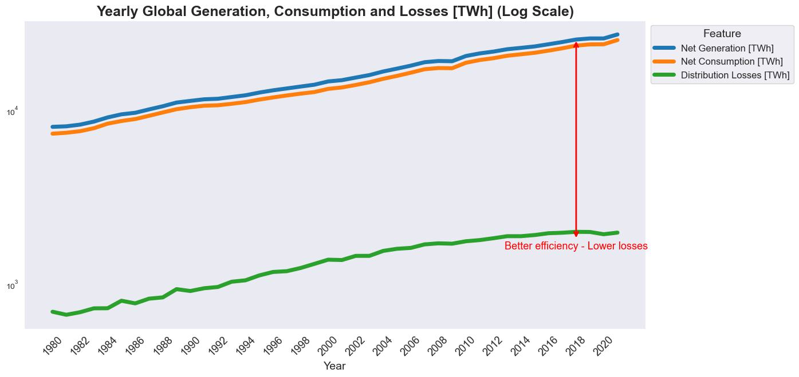
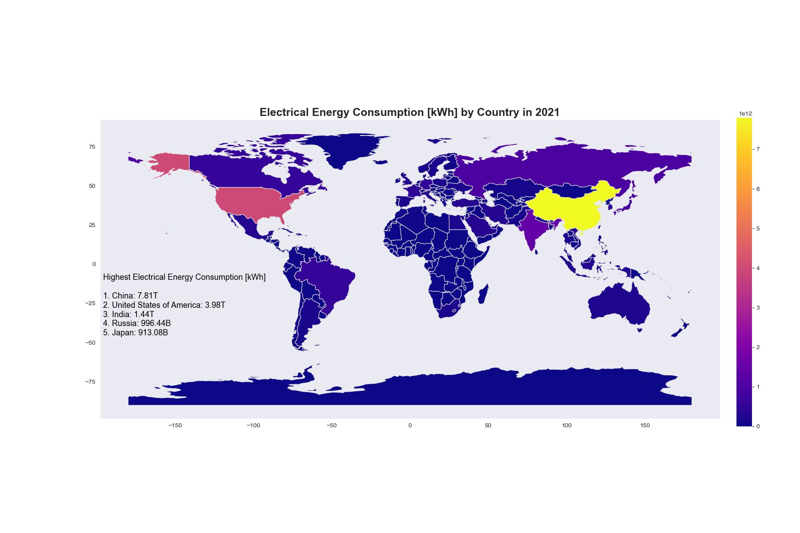
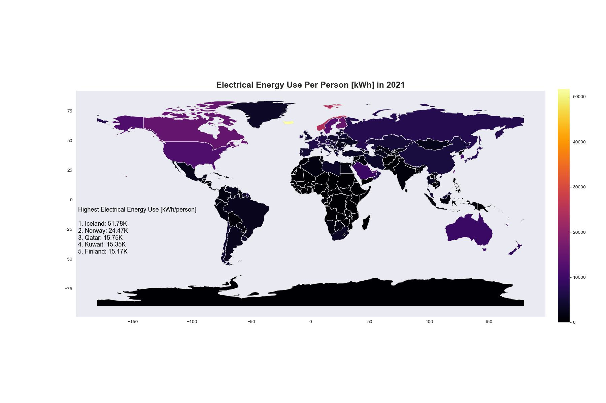
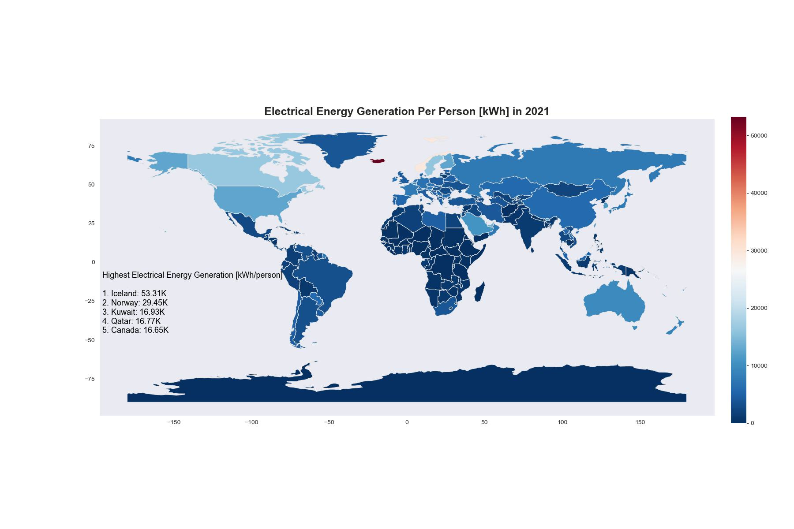

# Report on Global Electrical Energy Consumption Analysis

## Introduction
In this report, we present a comprehensive analysis of energy consumption trends and patterns based on the provided dataset taken from KAGGLE. The analysis encompasses various aspects, including yearly consumption, regional variations, consumption ratios, losses, and global perspectives. 
The following sections provide a detailed explanation for the report.

## 1. Yearly Consumption Trend

    

The graph above illustrates the yearly energy consumption trends. The data reveals a linear increase trend of the electrical energy consumption in the world, not considering two interesting periods (2009 and 2020).  
Firstly, in 2009 we can observe a decrease in consumption from the past year, which is interesting. Acording to other researches, this decrease in consumption was caused by recession that happened during this period. Recession was a sharp decline in economic activity from 2007-2009, that affected the energy consumption as well.  
2020 was the pandemic period. During the lockdown (i.e. limited restrictions, partial lockdown or full lockdown), curtailment in many activities, e.g. mobility, economic activity, construction and manufacturing, dropped the global energy demand.

## 2. Yearly Consumption by Regions

    

The second graph breaks down energy consumption by regions. Each color corresponds to a specific geographic area, providing insights into regional disparities in energy usage. From the figure, we can observe that "Asia & Oceania"'s consumption increased rapidly from around 2003. This indicates, the increase in the industry in this region.

## 3. Consumption Ratio Change

    

The third graph focuses on the consumption ratio, highlighting the proportion of energy derived from different sources. This analysis sheds light on the sustainability and diversity of the energy mix, aiding in the development of strategies to promote cleaner and more efficient energy production.

## 4. Yearly Consumption Ratio Trends

    

Building on the previous analysis, the fourth graph extends the understanding of consumption ratios by presenting their trends over the years. Identifying shifts in these trends is critical for predicting future energy landscapes and adapting policies accordingly.

## 5. Yearly Energy Losses

    

The fifth graph delves into energy losses, offering insights into the efficiency of energy transmission and distribution systems. Understanding and mitigating these losses are essential for optimizing energy infrastructure and reducing overall energy waste.

## 6. Global Energy Consumption

    

The sixth graph provides a global perspective on energy consumption. It depicts the total energy consumption on a global scale, emphasizing the magnitude of the challenge and the need for collaborative efforts to address energy sustainability.

## 7. Global Energy Consumption Per Person

    

In the seventh graph, we analyze energy consumption on a per-person basis globally. This metric is crucial for assessing the equitable distribution of energy resources and identifying regions with potential for improvement in energy efficiency.

## 8. Global Energy Generation Per Person

    

The eighth and final graph explores the per-person energy generation globally. Understanding how much energy each person contributes or has access to is pivotal for devising strategies that ensure fair and sustainable energy distribution.

## Conclusion
This report provides a multifaceted analysis of energy consumption trends, shedding light on various dimensions of global energy use. The insights gained from these analyses can inform policy decisions, drive sustainability initiatives, and guide future research and development efforts in the energy sector.

